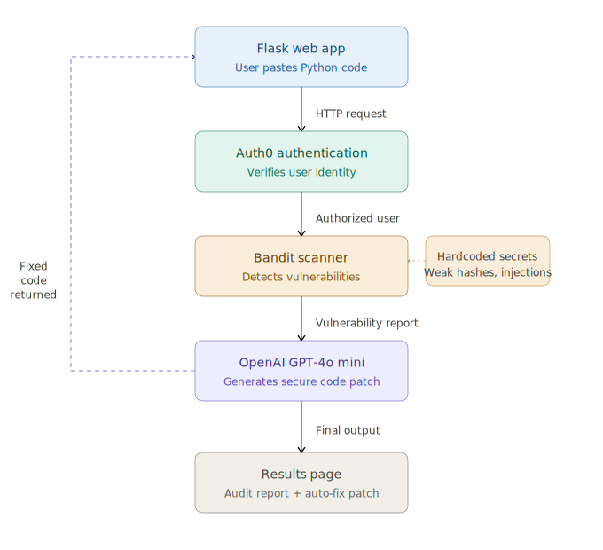

# 🛡️ Sentinel AI Remediator
### *Because finding bugs is only half the battle — fixing them is the real win.*

[](https://python.org)
[](https://flask.palletsprojects.com)
[](https://openai.com)
[](https://auth0.com)
[](https://bandit.readthedocs.io)
[](LICENSE)

---

## 🚨 The Problem

Every day, developers unknowingly push **insecure Python code** to production:

- 🔴 **Command Injection** — `os.system("rm " + user_input)` can wipe entire servers
- 🔴 **Weak Password Hashing** — MD5 hashes are cracked in milliseconds
- 🔴 **Hardcoded Secrets** — API keys committed to repos, exposed forever

Most security tools **only tell you what's wrong**. Developers still have to figure out how to fix it — wasting hours and leaving systems vulnerable.

---

## 💡 Our Solution

**Sentinel AI Remediator** is a full-stack, AI-powered security auditor that does two things no existing free tool does together:

1. **Scans** your Python code using Bandit (industry-standard static analysis)
2. **Fixes it automatically** using OpenAI GPT-4o mini — generating a complete, secure code patch in seconds

> *Paste vulnerable code → Get a fixed, production-ready version instantly.*

---

## 📊 System Architecture



**Request Flow:**
```
User (Browser)
    ↓  Login via Auth0
Flask Backend
    ↓  Code submitted
Bandit Scanner  →  Vulnerability Report (CWE-78, CWE-327, CWE-259)
    ↓
OpenAI GPT-4o mini  →  Auto-Generated Secure Code Patch
    ↓
Results Page (Audit Report + Fixed Code + PDF Export)
```

---

## 🚀 Key Features

| Feature | Description |
|---|---|
| 🔍 **Static Analysis** | Detects Shell Injections (CWE-78), Weak Hashes (CWE-327), Hardcoded Secrets (CWE-259) |
| 🤖 **AI Auto-Fix** | GPT-4o mini rewrites your vulnerable code with inline comments explaining every fix |
| 🔐 **Auth0 Authentication** | Only authorized users can access the AI scanning resources |
| 📄 **PDF Export** | One-click export of the full audit report for sharing with teams |
| ⚡ **Real-time Results** | Scan + Fix delivered in under 30 seconds |
| 🌙 **Dark UI** | Professional GitHub-style dark interface |

---

## 🎯 Live Demo

**Test it yourself with this vulnerable code snippet:**

```python
import os
import hashlib

filename = input("Enter filename: ")
os.system("cat " + filename)        # CWE-78: Command Injection

password = "admin123"               # CWE-259: Hardcoded Secret
hashed = hashlib.md5(password.encode()).hexdigest()  # CWE-327: Weak Hash
```

**What Sentinel AI Remediator returns:**
```python
import os
import hashlib
import subprocess

filename = input("Enter filename: ")
subprocess.run(["cat", filename], check=True)  # Fixed: list args, no shell injection

password = os.getenv("APP_PASSWORD")           # Fixed: loaded from environment
hashed = hashlib.sha256(password.encode()).hexdigest()  # Fixed: SHA-256 is secure
```

---

## 🛠️ How to Run Locally

### Prerequisites
- Python 3.12+
- An [OpenAI API Key](https://platform.openai.com/api-keys) (GPT-4o mini)
- An [Auth0 Account](https://auth0.com) (free tier)

### Installation

```bash
# 1. Clone the repository
git clone https://github.com/yashrajkshatriya74-star/Sentinel-AI-Remediator.git
cd Sentinel-AI-Remediator

# 2. Create a virtual environment
python -m venv venv
venv\Scripts\activate        # Windows
# source venv/bin/activate   # Mac/Linux

# 3. Install dependencies
pip install -r requirements.txt

# 4. Configure environment
cp .env.example .env
# Edit .env with your API keys

# 5. Launch
python main.py
```

Open `http://127.0.0.1:5000` in your browser.

### Environment Variables

```env
AUTH0_DOMAIN=your-domain.us.auth0.com
AUTH0_CLIENT_ID=your_client_id
AUTH0_CLIENT_SECRET=your_client_secret
SECRET_KEY=any_random_string
OPENAI_API_KEY=sk-proj-...
```

---

## 🧪 Vulnerability Coverage

| CWE ID | Vulnerability | Severity | Auto-Fixed? |
|--------|--------------|----------|-------------|
| CWE-78 | OS Command Injection | 🔴 High | ✅ Yes |
| CWE-327 | Weak Cryptographic Hash (MD5) | 🔴 High | ✅ Yes |
| CWE-259 | Hardcoded Password/Secret | 🟡 Low-Medium | ✅ Yes |
| CWE-78 | Subprocess Shell Injection | 🔴 High | ✅ Yes |

---

## 🏗️ Tech Stack

| Layer | Technology |
|---|---|
| Backend | Python 3.12, Flask |
| Authentication | Auth0 (OAuth 2.0 / OpenID Connect) |
| Static Analysis | Bandit 1.9.4 |
| AI Engine | OpenAI GPT-4o mini |
| Frontend | HTML5, CSS3 (inline Flask templates) |
| Environment | python-dotenv |

---

## 📁 Project Structure

```
Sentinel-AI-Remediator/
├── main.py                        # Flask app — all routes + AI engine
├── requirements.txt               # Python dependencies
├── .env.example                   # Environment variable template
├── sentinel_guard_architecture.svg  # System architecture diagram
├── LICENSE                        # MIT License
└── README.md                      # This file
```

---

## 🔒 Security Notes

- `.env` file is **never committed** (see `.gitignore`)
- All user sessions managed securely via Auth0
- User-submitted code runs in an isolated `tempfile` — deleted immediately after scan
- No user code is stored or logged

---

## 🌟 What Makes This Different

| Tool | Finds Bugs | Explains Bugs | Auto-Fixes Code | Auth |
|------|-----------|---------------|-----------------|------|
| Bandit (alone) | ✅ | ❌ | ❌ | ❌ |
| SonarQube (free) | ✅ | Partial | ❌ | ❌ |
| **Sentinel AI Remediator** | ✅ | ✅ | ✅ | ✅ |

---

## 👨‍💻 Author

**Yashraj Kshatriya**
- GitHub: [@yashrajkshatriya74-star](https://github.com/yashrajkshatriya74-star)

---

## 📄 License

This project is licensed under the MIT License — see the [LICENSE](LICENSE) file for details.

---

<p align="center">
  Built with ❤️ for the Hackathon — Powered by Bandit & OpenAI GPT-4o mini
</p>
